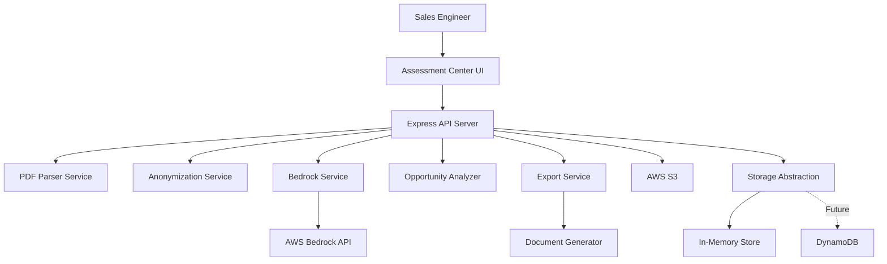

# Design Document: Sales Opportunity Analyzer

## Overview

The Sales Opportunity Analyzer extends the AWS Assessment Center with AI-powered sales intelligence. The system processes Migration Portfolio Assessment (MPA) Excel files and Migration Readiness Assessment (MRA) PDF documents through AWS Bedrock's Claude 3.5 Sonnet model to identify, prioritize, and document sales opportunities.

The architecture follows a layered approach:
1. **Input Layer**: PDF parsing and data extraction
2. **Security Layer**: Data anonymization and validation
3. **AI Layer**: Bedrock integration and prompt engineering
4. **Analysis Layer**: Opportunity extraction and prioritization
5. **Presentation Layer**: Dashboard UI and export generation
6. **Storage Layer**: Abstracted persistence (in-memory for MVP, DynamoDB-ready)

Key design principles:
- Security-first: Anonymize before AI processing
- Extensibility: Storage abstraction for future persistence
- Performance: Parallel processing where possible
- Consistency: Reuse existing patterns from MPA processing
- Reliability: Comprehensive error handling and retry logic

## Architecture

### System Context



### Component Architecture

**Backend Services** (TypeScript/Node.js):
- `PdfParserService`: Extracts text from MRA PDFs using pdf-parse library
- `AnonymizationService`: Masks sensitive data with reversible tokens
- `BedrockService`: Manages AWS Bedrock API interactions with Claude 3.5 Sonnet
- `OpportunityAnalyzerService`: Parses Bedrock responses into structured opportunities
- `OpportunityStorageService`: Abstraction layer for opportunity persistence
- `ExportService`: Generates PDF/Word sales playbooks using existing docx library

**API Layer**:
- `OpportunityController`: Handles HTTP requests for opportunity operations
- `OpportunityRoutes`: Defines REST endpoints with validation

**Frontend Components** (React/TypeScript):
- `OpportunityDashboard`: Main container with tabs integration
- `OpportunityList`: Grid/list view with filters and search
- `OpportunityCard`: Summary card component
- `OpportunityDetail`: Full opportunity view with actions
- `OpportunityFilters`: Filter controls for priority, value, state
- `ExportButton`: Triggers playbook generation

### Data Flow

1. **Analysis Request Flow**:
   ```
   User uploads MPA + MRA → API receives files → 
   Parse PDF → Extract MPA data → Anonymize both →
   Send to Bedrock → Parse response → Store opportunities →
   Return to UI
   ```

2. **Opportunity Retrieval Flow**:
   ```
   User requests opportunities → Apply filters →
   Retrieve from storage → Return to UI → Render dashboard
   ```

3. **Export Flow**:
   ```
   User clicks export → Retrieve opportunities →
   Generate document → Upload to S3 → Return signed URL
   ```

## Components and Interfaces

### PdfParserService

**Purpose**: Extract and structure text content from MRA PDF documents.

**Interface**:
```typescript
interface PdfParserService {
  /**
   * Parse PDF from buffer and extract structured content
   * @param buffer - PDF file buffer
   * @returns Structured MRA data
   * @throws PdfParseError if parsing fails
   */
  parsePdf(buffer: Buffer): Promise<MraData>;
  
  /**
   * Validate PDF structure and content
   * @param buffer - PDF file buffer
   * @returns Validation result with errors if any
   */
  validatePdf(buffer: Buffer): Promise<ValidationResult>;
}

interface MraData {
  maturityLevel: number; // 1-5
  securityGaps: string[];
  drStrategy: string;
  backupStrategy: string;
  complianceRequirements: string[];
  technicalDebt: string[];
  recommendations: string[];
  rawText: string; // Full extracted text
}

interface ValidationResult {
  valid: boolean;
  errors: string[];
  warnings: string[];
}
```

**Implementation Details**:
- Use `pdf-parse` library for text extraction
- Apply heuristics to identify sections (maturity, gaps, recommendations)
- Handle multi-page documents with section continuity
- Extract tables and structured data where possible
- Fallback to raw text if structure detection fails
- Validate minimum content length (>100 characters)

### AnonymizationService

**Purpose**: Mask sensitive data before sending to Bedrock while preserving analytical value.

**Interface**:
```typescript
interface AnonymizationService {
  /**
   * Anonymize assessment data for AI processing
   * @param mpaData - MPA Excel data
   * @param mraData - MRA PDF data
   * @returns Anonymized data and reverse mapping
   */
  anonymize(mpaData: ExcelData, mraData: MraData): AnonymizedData;
  
  /**
   * Restore original values in AI response
   * @param response - Bedrock response text
   * @param mapping - Anonymization mapping
   * @returns Response with original values restored
   */
  deanonymize(response: string, mapping: AnonymizationMapping): string;
}

interface AnonymizedData {
  mpaData: Partial<ExcelData>;
  mraData: Partial<MraData>;
  mapping: AnonymizationMapping;
}

interface AnonymizationMapping {
  ipAddresses: Map<string, string>; // original -> token
  hostnames: Map<string, string>;
  companyNames: Map<string, string>;
  reverseMap: Map<string, string>; // token -> original
}
```

**Implementation Details**:
- **IP Address Anonymization**: Replace with tokens like `IP_001`, `IP_002`
- **Hostname Anonymization**: Replace with tokens like `HOST_001`, `HOST_002`
- **Company Name Anonymization**: Replace with generic `COMPANY_A`, `COMPANY_B`
- **Preserve**: Technology names, architecture patterns, counts, maturity levels
- Use regex patterns for detection:
  - IP: `\b(?:\d{1,3}\.){3}\d{1,3}\b`
  - Hostname: `\b[a-zA-Z0-9][-a-zA-Z0-9]{0,62}(?:\.[a-zA-Z0-9][-a-zA-Z0-9]{0,62})+\b`
- Maintain bidirectional mapping for deanonymization
- Validate no sensitive patterns remain after anonymization

### BedrockService

**Purpose**: Interface with AWS Bedrock API using Claude 3.5 Sonnet for opportunity analysis.

**Interface**:
```typescript
interface BedrockService {
  /**
   * Analyze assessment data and generate opportunities
   * @param anonymizedData - Anonymized MPA and MRA data
   * @returns Raw Bedrock response
   * @throws BedrockError if API call fails after retries
   */
  analyzeOpportunities(anonymizedData: AnonymizedData): Promise<BedrockResponse>;
  
  /**
   * Build prompt for Bedrock analysis
   * @param data - Anonymized assessment data
   * @returns Structured prompt
   */
  buildPrompt(data: AnonymizedData): string;
}

interface BedrockResponse {
  content: string;
  usage: {
    inputTokens: number;
    outputTokens: number;
  };
  modelId: string;
}
```

**Implementation Details**:
- **Model**: Use `anthropic.claude-3-5-sonnet-20241022-v2:0` (latest Claude 3.5 Sonnet)
- **AWS SDK**: Use `@aws-sdk/client-bedrock-runtime`
- **Retry Logic**: Exponential backoff (1s, 2s, 4s) for transient errors
- **Timeout**: 30 seconds per request
- **Prompt Structure**:
  ```
  You are an AWS sales opportunity analyst. Analyze the following assessment data and identify sales opportunities.
  
  MPA Data Summary:
  - Total Servers: {count}
  - Databases: {count}
  - Applications: {count}
  - Technology Stack: {summary}
  
  MRA Data Summary:
  - Maturity Level: {level}
  - Security Gaps: {list}
  - DR Strategy: {status}
  - Technical Debt: {summary}
  
  Generate 3-7 sales opportunities in JSON format with:
  - title (Spanish)
  - priority (High/Medium/Low)
  - estimatedARR (number)
  - reasoning (Spanish, 2-3 sentences)
  - talkingPoints (array of 3-5 strings in Spanish)
  - nextSteps (array of 2-4 strings in Spanish)
  - relatedServices (array of AWS service names)
  
  Respond ONLY with valid JSON array.
  ```
- **Error Handling**: Log to CloudWatch, retry on throttling, fail gracefully
- **Validation**: Verify response is valid JSON before returning

### OpportunityAnalyzerService

**Purpose**: Parse and structure Bedrock responses into opportunity objects.

**Interface**:
```typescript
interface OpportunityAnalyzerService {
  /**
   * Parse Bedrock response into structured opportunities
   * @param response - Raw Bedrock response
   * @param mapping - Anonymization mapping for deanonymization
   * @returns Array of structured opportunities
   */
  parseOpportunities(
    response: BedrockResponse,
    mapping: AnonymizationMapping
  ): Opportunity[];
  
  /**
   * Validate and enrich opportunity data
   * @param opportunity - Raw opportunity from Bedrock
   * @returns Validated and enriched opportunity
   */
  validateOpportunity(opportunity: RawOpportunity): Opportunity;
}

interface RawOpportunity {
  title: string;
  priority: string;
  estimatedARR: number;
  reasoning: string;
  talkingPoints: string[];
  nextSteps: string[];
  relatedServices: string[];
}

interface Opportunity extends RawOpportunity {
  id: string; // UUID
  status: OpportunityStatus;
  createdAt: Date;
  updatedAt: Date;
}

type OpportunityStatus = 'Nueva' | 'En Progreso' | 'Ganada' | 'Perdida' | 'Descartada';
```

**Implementation Details**:
- Parse JSON response from Bedrock
- Generate UUID for each opportunity
- Set initial status to 'Nueva'
- Validate required fields present
- Validate priority is High/Medium/Low
- Validate estimatedARR is positive number
- Validate arrays have minimum required items
- Deanonymize any remaining tokens in text fields
- Sort opportunities by priority then ARR
- Add timestamps for tracking

### OpportunityStorageService

**Purpose**: Abstract storage layer for opportunities (in-memory for MVP, DynamoDB-ready).

**Interface**:
```typescript
interface OpportunityStorageService {
  /**
   * Store opportunities from analysis
   * @param opportunities - Array of opportunities to store
   * @param sessionId - Session identifier for grouping
   */
  storeOpportunities(opportunities: Opportunity[], sessionId: string): Promise<void>;
  
  /**
   * Retrieve opportunities with optional filters
   * @param sessionId - Session identifier
   * @param filters - Optional filter criteria
   * @returns Filtered opportunities
   */
  getOpportunities(sessionId: string, filters?: OpportunityFilters): Promise<Opportunity[]>;
  
  /**
   * Update opportunity status
   * @param id - Opportunity ID
   * @param status - New status
   */
  updateStatus(id: string, status: OpportunityStatus): Promise<void>;
  
  /**
   * Get single opportunity by ID
   * @param id - Opportunity ID
   */
  getOpportunity(id: string): Promise<Opportunity | null>;
}

interface OpportunityFilters {
  priority?: string[];
  minARR?: number;
  maxARR?: number;
  status?: OpportunityStatus[];
  searchTerm?: string;
}
```

**Implementation Details**:
- **MVP Implementation**: In-memory Map with sessionId as key
- **Session Management**: Generate sessionId from analysis request, return to client
- **Future DynamoDB Schema**:
  ```
  Table: Opportunities
  PK: sessionId (String)
  SK: opportunityId (String)
  Attributes: title, priority, estimatedARR, status, createdAt, etc.
  GSI: status-index (for filtering by status)
  ```
- **Filter Implementation**: Apply filters in-memory for MVP
- **Search Implementation**: Search across title, reasoning, talkingPoints
- **Migration Path**: Replace Map with DynamoDB client, keep interface unchanged

### ExportService

**Purpose**: Generate professional sales playbook documents in PDF/Word format.

**Interface**:
```typescript
interface ExportService {
  /**
   * Generate sales playbook document
   * @param opportunities - Opportunities to include
   * @param format - Output format (pdf or docx)
   * @returns S3 key for generated document
   */
  generatePlaybook(
    opportunities: Opportunity[],
    format: 'pdf' | 'docx'
  ): Promise<string>;
  
  /**
   * Get download URL for generated playbook
   * @param s3Key - S3 object key
   * @returns Signed URL valid for 1 hour
   */
  getDownloadUrl(s3Key: string): Promise<string>;
}
```

**Implementation Details**:
- Reuse existing `docxService` for Word generation
- Use `docx` library for document structure
- **Document Structure**:
  - Title page with summary
  - Table of contents
  - Executive summary with total ARR
  - Opportunities grouped by priority
  - Each opportunity: full details, talking points, next steps
  - Appendix with AWS service descriptions
- **Styling**: Professional formatting, consistent fonts, proper spacing
- **PDF Generation**: Use `docx` to generate .docx, then convert if needed (or use library like `pdfkit`)
- **S3 Storage**: Upload to same bucket as reports, 1-hour retention
- **Filename**: `playbook-{sessionId}-{timestamp}.{format}`

## Data Models

### Core Types

```typescript
// Opportunity entity
interface Opportunity {
  id: string;
  title: string;
  priority: 'High' | 'Medium' | 'Low';
  estimatedARR: number;
  reasoning: string;
  talkingPoints: string[];
  nextSteps: string[];
  relatedServices: string[];
  status: OpportunityStatus;
  createdAt: Date;
  updatedAt: Date;
}

type OpportunityStatus = 'Nueva' | 'En Progreso' | 'Ganada' | 'Perdida' | 'Descartada';

// MRA parsed data
interface MraData {
  maturityLevel: number;
  securityGaps: string[];
  drStrategy: string;
  backupStrategy: string;
  complianceRequirements: string[];
  technicalDebt: string[];
  recommendations: string[];
  rawText: string;
}

// Analysis request
interface AnalysisRequest {
  mpaFile: Buffer;
  mraFile: Buffer;
  sessionId?: string; // Optional, generated if not provided
}

// Analysis response
interface AnalysisResponse {
  sessionId: string;
  opportunities: Opportunity[];
  summary: {
    totalOpportunities: number;
    totalEstimatedARR: number;
    highPriorityCount: number;
  };
}

// Export request
interface ExportRequest {
  sessionId: string;
  format: 'pdf' | 'docx';
  opportunityIds?: string[]; // Optional, export all if not provided
}

// Export response
interface ExportResponse {
  downloadUrl: string;
  expiresAt: Date;
  filename: string;
}
```

### API Request/Response Schemas

```typescript
// POST /api/opportunities/analyze
interface AnalyzeRequestBody {
  // Multipart form data
  mpaFile: File; // Excel file
  mraFile: File; // PDF file
}

interface AnalyzeResponseBody {
  success: boolean;
  data?: AnalysisResponse;
  error?: string;
}

// GET /api/opportunities/list?sessionId=xxx&priority=High&minARR=100000
interface ListRequestQuery {
  sessionId: string;
  priority?: string; // Comma-separated: High,Medium,Low
  minARR?: string; // Number as string
  maxARR?: string;
  status?: string; // Comma-separated status values
  search?: string;
}

interface ListResponseBody {
  success: boolean;
  data?: {
    opportunities: Opportunity[];
    total: number;
  };
  error?: string;
}

// PATCH /api/opportunities/:id/status
interface UpdateStatusRequestBody {
  status: OpportunityStatus;
}

interface UpdateStatusResponseBody {
  success: boolean;
  data?: Opportunity;
  error?: string;
}

// POST /api/opportunities/export
interface ExportRequestBody {
  sessionId: string;
  format: 'pdf' | 'docx';
  opportunityIds?: string[];
}

interface ExportResponseBody {
  success: boolean;
  data?: ExportResponse;
  error?: string;
}
```

## Correctness Properties

*A property is a characteristic or behavior that should hold true across all valid executions of a system—essentially, a formal statement about what the system should do. Properties serve as the bridge between human-readable specifications and machine-verifiable correctness guarantees.*


### Property 1: File Size Validation
*For any* uploaded PDF file, if the file size is less than or equal to 50MB, the system should accept it; if the file size exceeds 50MB, the system should reject it with an appropriate error message.
**Validates: Requirements 1.1**

### Property 2: S3 Storage After Processing
*For any* successfully processed PDF file, the file should exist in S3 storage after processing completes.
**Validates: Requirements 1.3**

### Property 3: Error Messages on Failure
*For any* PDF processing failure, the system should return a non-empty error message describing the failure.
**Validates: Requirements 1.4**

### Property 4: Comprehensive Sensitive Data Anonymization
*For any* assessment data containing IP addresses, hostnames, or company names, after anonymization, none of these sensitive patterns should remain in the anonymized output.
**Validates: Requirements 2.1, 2.2, 2.3, 2.6**

### Property 5: Preservation of Non-Sensitive Data
*For any* assessment data containing architecture patterns, technology stacks, maturity levels, or gap information, after anonymization, these elements should remain unchanged in the anonymized output.
**Validates: Requirements 2.4**

### Property 6: Anonymization Round-Trip
*For any* assessment data, anonymizing then deanonymizing should produce data equivalent to the original.
**Validates: Requirements 2.5**

### Property 7: Bedrock Prompt Contains Required Data
*For any* anonymized assessment data, the generated Bedrock prompt should contain references to server counts, database counts, maturity level, and security gaps.
**Validates: Requirements 3.2**

### Property 8: Bedrock Response Validation
*For any* Bedrock response, if the response is not valid JSON or missing required fields, the validation should reject it.
**Validates: Requirements 3.6**

### Property 9: CloudWatch Logging Without Sensitive Data
*For any* analysis request, the CloudWatch log entry should not contain IP addresses, hostnames, or company names.
**Validates: Requirements 3.5, 9.5**

### Property 10: Opportunity Required Fields
*For any* parsed opportunity, it should contain all required fields: title, priority, estimatedARR, reasoning, talkingPoints (minimum 3 items), nextSteps (minimum 2 items), and relatedServices (non-empty).
**Validates: Requirements 4.1, 4.4, 4.5, 4.6**

### Property 11: Valid Priority Values
*For any* generated opportunity, the priority value should be exactly one of: High, Medium, or Low.
**Validates: Requirements 4.2**

### Property 12: Opportunity Sort Order
*For any* list of opportunities, they should be sorted first by priority (High > Medium > Low), then by estimatedARR in descending order within each priority level.
**Validates: Requirements 4.3**

### Property 13: Valid Opportunity Status Values
*For any* opportunity status update, the system should only accept status values from the set: Nueva, En Progreso, Ganada, Perdida, Descartada.
**Validates: Requirements 5.1, 5.3**

### Property 14: Initial Status is Nueva
*For any* newly created opportunity, its status should be set to 'Nueva'.
**Validates: Requirements 5.2**

### Property 15: Status Update Persistence
*For any* opportunity, updating its status then immediately retrieving it should return the updated status value.
**Validates: Requirements 5.4**

### Property 16: Spanish Language Output
*For any* generated opportunity, the title, reasoning, talkingPoints, and nextSteps should contain Spanish text (verified by presence of Spanish-specific characters or common Spanish words).
**Validates: Requirements 6.3**

### Property 17: Spanish Export Content
*For any* exported sales playbook, the document content should be in Spanish.
**Validates: Requirements 6.5**

### Property 18: Opportunity Card Required Information
*For any* rendered opportunity card, it should display the title, priority, estimatedARR, and status.
**Validates: Requirements 7.2**

### Property 19: Search Functionality
*For any* opportunity list and search term, if an opportunity's title, reasoning, or talkingPoints contains the search term, it should appear in the search results.
**Validates: Requirements 7.4**

### Property 20: High-Value Opportunity Indicators
*For any* opportunity with estimatedARR greater than 200000, the dashboard should display a visual indicator for high value.
**Validates: Requirements 7.6**

### Property 21: Export Format Support
*For any* export request specifying format 'pdf' or 'docx', the system should generate a valid file in the requested format.
**Validates: Requirements 8.1, 8.2**

### Property 22: Export Includes All Opportunities
*For any* set of opportunities, exporting them should produce a document that contains all opportunity titles and details.
**Validates: Requirements 8.3**

### Property 23: Export Summary with Total ARR
*For any* exported playbook, it should include a summary section containing the sum of all opportunity estimatedARR values.
**Validates: Requirements 8.5**

### Property 24: S3 Encryption Metadata
*For any* file stored in S3, the object metadata should indicate server-side encryption is enabled.
**Validates: Requirements 9.2**

### Property 25: S3 Retention Policy Applied
*For any* file stored in S3, the object should have the same lifecycle policy applied as MPA files.
**Validates: Requirements 9.3**

### Property 26: No Sensitive Data to Bedrock
*For any* data sent to the Bedrock API, it should not contain IP addresses, hostnames, or company names.
**Validates: Requirements 9.6**

### Property 27: List Endpoint Filtering
*For any* opportunity list request with filters, only opportunities matching all specified filter criteria should be returned.
**Validates: Requirements 10.3**

### Property 28: Error Response Format
*For any* API endpoint error, the response should include an appropriate HTTP status code (4xx or 5xx) and a non-empty error message.
**Validates: Requirements 10.6**

### Property 29: On-Demand Generation
*For any* analysis request with the same input files, the system should generate fresh opportunities each time (not cached results).
**Validates: Requirements 11.3**

### Property 30: Minimum Opportunity Count
*For any* typical assessment data (containing servers, databases, and identified gaps), the system should generate at least 3 opportunities.
**Validates: Requirements 12.4**

### Property 31: Concurrent Request Safety
*For any* two concurrent analysis requests with different input data, each should receive opportunities corresponding only to their own input data without cross-contamination.
**Validates: Requirements 12.5**

## Error Handling

### Error Categories

1. **Input Validation Errors** (HTTP 400)
   - Invalid file format (not PDF/Excel)
   - File size exceeds limit
   - Missing required files
   - Malformed request body

2. **Processing Errors** (HTTP 422)
   - PDF parsing failure
   - Excel parsing failure
   - Invalid assessment data structure
   - Anonymization failure

3. **External Service Errors** (HTTP 502/503)
   - Bedrock API unavailable
   - Bedrock API throttling
   - S3 service unavailable
   - CloudWatch logging failure

4. **Business Logic Errors** (HTTP 404/409)
   - Opportunity not found
   - Invalid status transition
   - Session expired

5. **Internal Errors** (HTTP 500)
   - Unexpected exceptions
   - Data corruption
   - Configuration errors

### Error Handling Strategy

**Retry Logic**:
- Bedrock API calls: 3 retries with exponential backoff (1s, 2s, 4s)
- S3 operations: 2 retries with 1s delay
- Transient errors only (throttling, timeouts, 5xx responses)

**Error Logging**:
- All errors logged to CloudWatch with:
  - Timestamp
  - Error type and message
  - Request ID for tracing
  - Anonymized context (no sensitive data)
- Critical errors trigger CloudWatch alarms

**User-Facing Errors**:
- Clear, actionable error messages in Spanish
- Avoid exposing internal implementation details
- Provide guidance for resolution when possible
- Include support contact for persistent issues

**Graceful Degradation**:
- If Bedrock unavailable: Return error, suggest retry later
- If S3 unavailable: Process in memory, warn about no persistence
- If export fails: Provide opportunities in JSON format as fallback

### Error Response Format

```typescript
interface ErrorResponse {
  success: false;
  error: {
    code: string; // Machine-readable error code
    message: string; // Human-readable message in Spanish
    details?: any; // Optional additional context
    requestId: string; // For support tracing
  };
}
```

## Testing Strategy

### Dual Testing Approach

The testing strategy employs both unit tests and property-based tests to ensure comprehensive coverage:

**Unit Tests**: Focus on specific examples, edge cases, and integration points
- PDF parsing with known sample documents
- Anonymization with specific sensitive data patterns
- Bedrock retry logic with simulated failures
- API endpoint responses with specific inputs
- Export generation with sample opportunities
- Error handling for specific failure scenarios

**Property-Based Tests**: Verify universal properties across randomized inputs
- File size validation across random file sizes
- Anonymization across random data with various sensitive patterns
- Opportunity validation across random Bedrock responses
- Sort order across random opportunity lists
- Search functionality across random search terms
- Concurrent request safety with random simultaneous requests

### Property-Based Testing Configuration

**Library**: Use `fast-check` for TypeScript property-based testing

**Configuration**:
- Minimum 100 iterations per property test
- Each test tagged with feature name and property number
- Tag format: `Feature: sales-opportunity-analyzer, Property {N}: {description}`

**Example Property Test Structure**:
```typescript
import fc from 'fast-check';

// Feature: sales-opportunity-analyzer, Property 1: File Size Validation
test('accepts files <= 50MB and rejects files > 50MB', () => {
  fc.assert(
    fc.property(
      fc.integer({ min: 0, max: 100 * 1024 * 1024 }), // Random file size
      async (fileSize) => {
        const result = await validateFileSize(fileSize);
        if (fileSize <= 50 * 1024 * 1024) {
          expect(result.valid).toBe(true);
        } else {
          expect(result.valid).toBe(false);
          expect(result.error).toBeTruthy();
        }
      }
    ),
    { numRuns: 100 }
  );
});
```

### Test Coverage Requirements

**Unit Test Coverage**:
- PDF parsing: Test with 3-5 sample MRA documents (English and Spanish)
- Anonymization: Test specific patterns (IPs, hostnames, company names)
- Bedrock integration: Mock API responses, test retry logic
- Opportunity parsing: Test with sample Bedrock responses
- Export generation: Test PDF and Word formats with sample data
- API endpoints: Test each endpoint with valid and invalid inputs
- Error handling: Test each error category with specific triggers

**Property Test Coverage**:
- All 31 correctness properties must have corresponding property tests
- Each property test runs minimum 100 iterations
- Tests should use appropriate generators for random data:
  - File sizes: integers in relevant ranges
  - Text content: strings with/without sensitive patterns
  - Opportunities: structured objects with random valid values
  - Status values: random selection from valid set

**Integration Test Coverage**:
- End-to-end analysis flow: Upload → Parse → Anonymize → Bedrock → Store → Retrieve
- Export flow: Generate → Upload to S3 → Download
- Concurrent requests: Multiple simultaneous analysis requests
- Error recovery: Simulate service failures and verify recovery

### Testing Best Practices

- Mock external services (Bedrock, S3) in unit tests
- Use real services in integration tests (with test AWS account)
- Isolate tests: Each test should be independent
- Clean up: Delete test data from S3 after tests
- Performance: Property tests should complete within reasonable time
- Determinism: Use seeded random generators for reproducibility
- Documentation: Each test should clearly state what it validates

### Continuous Testing

- Run unit tests on every commit
- Run property tests on every pull request
- Run integration tests nightly
- Monitor test execution time and fail if exceeds thresholds
- Track test coverage and maintain >80% coverage
- Alert on test failures in CI/CD pipeline
